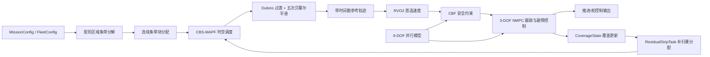

# 无人艇集群矩形区域全覆盖路径规划与控制实现说明

## 1. 目标与适用范围

本文档给出一套面向同构无人艇集群的矩形区域全覆盖算法实现方案，满足以下约束与能力：

- 覆盖区域为已知静态矩形 `Omega=[0,Lx]x[0,Ly]`
- 单艇瞬时覆盖足迹为随航向旋转的矩形 `F=(lf,wf)`
- 艇体存在最小转弯半径 `Rmin`
- 采用 3-DOF 与 6-DOF 双模型并行
- 全局多艇协调采用 MAPF，求解器选用 CBS
- 局部动态避障采用 `CBF + RVO2 + NMPC`
- 跟踪层采用 NMPC
- 转向连接段采用五次贝塞尔曲线平滑
- 执行过程中维护覆盖状态并支持漏扫区域闭环补扫

这份说明的目标不是给出某一门语言的完整源码，而是给出足够细化的工程设计，使后续实现者可以直接据此编码。

## 2. 总体架构



### 2.1 分层职责

- 全局覆盖层：负责条带生成、任务分配、MAPF 时空调度、参考轨迹生成
- 局部安全层：负责 RVO2 首选避障速度、CBF 安全约束、NMPC 在线优化
- 高保真校核层：负责 6-DOF 并行预测、失配估计、约束收紧与速度降额
- 覆盖闭环层：负责覆盖率统计、漏扫检测、残差条带回填

### 2.2 频率建议

- 全局覆盖/MAPF 重规划：`0.2-1 Hz`
- RVO2 + CBF + NMPC 控制循环：`5-10 Hz`
- 6-DOF 并行校核：`2-5 Hz`
- 覆盖状态更新：`1-5 Hz`

## 3. 动力学模型

## 3.1 3-DOF 实时模型

状态与控制定义如下：

- 位姿与速度：`x3=[x,y,psi,u,v,r]^T`
- 控制量：`u3=[T,N]^T`
  - `T` 为总纵向推力
  - `N` 为偏航力矩

采用标准平面水面艇模型：

```text
x_dot   = u*cos(psi) - v*sin(psi)
y_dot   = u*sin(psi) + v*cos(psi)
psi_dot = r

M3 * nu3_dot + C3(nu3) * nu3 + D3(nu3) * nu3 = tau3 + d3
nu3 = [u,v,r]^T
tau3 = [T,0,N]^T
```

实现约定：

- 默认采用欠驱动 USV，横向控制输入为零
- 横荡速度 `v` 由动力学耦合自然产生
- NMPC 预测模型使用离散化后的 3-DOF 模型

## 3.2 6-DOF 并行高保真模型

状态定义：

- `x6=[x,y,z,phi,theta,psi,u,v,w,p,q,r]^T`

连续形式：

```text
eta_dot = J(eta) * nu6
M6 * nu6_dot + C6(nu6) * nu6 + D6(nu6) * nu6 + g6(eta) = tau6 + d6
nu6 = [u,v,w,p,q,r]^T
```

并行层用途固定为：

- 根据 6-DOF 仿真或观测预测结果估计 3-DOF 模型失配
- 输出扰动估计 `what=[du_bias,dv_bias,dr_bias]`
- 估计横摇/纵摇对足迹有效宽度与可用速度的影响
- 将失配转化为 NMPC 约束收紧量与 CBF 安全裕度

### 3.3 双模型耦合方式

- 规划与实时控制一律基于 3-DOF 模型执行
- 6-DOF 层不直接替换控制器，而是提供补偿项
- 当 `||what||` 超过阈值或姿态扰动明显时：
  - 收紧艇间安全距离
  - 降低转弯段参考速度
  - 提高 NMPC 软约束罚权重

## 4. 几何建模与覆盖条带生成

## 4.1 基本定义

- 任务矩形：`Omega=[0,Lx]x[0,Ly]`
- 覆盖足迹：长 `lf`，宽 `wf`
- 重叠率：`rho in [0,1)`
- 有效条带间距：`Delta = wf * (1-rho)`
- 安全距离：`d_safe`
- 转向缓冲长度：`H >= Rmin + lf/2 + d_safe`

## 4.2 覆盖方向选择

规则固定为：

- 若 `Lx > Ly`，沿 `x` 方向扫掠，条带沿长边布置
- 若 `Ly > Lx`，沿 `y` 方向扫掠
- 若 `|Lx-Ly| <= eps_dim`，选择与艇群初始平均航向更接近的方向

这样可以最小化调头次数与端部拥堵。

## 4.3 条带数量与位置

以沿 `x` 方向覆盖为例：

- 条带法向覆盖宽度为 `Ly`
- 条带数：

```text
Ns = 1, if Ly <= wf
Ns = ceil((Ly - wf) / Delta) + 1, otherwise
```

- 第 `k` 条带中心线纵坐标：

```text
yc(k) = min(wf/2 + k*Delta, Ly - wf/2),  k=0,...,Ns-1
```

每条带生成一个 `StripTask`：

- 中心线起点 `p_start`
- 中心线终点 `p_goal`
- 起点航向 `psi_start`
- 终点航向 `psi_goal`
- 覆盖长度 `L_strip`
- 条带索引 `strip_id`

条带方向交替：

- 偶数条带：从左到右
- 奇数条带：从右到左

从而形成往复式扫掠。

## 4.4 端部转向缓冲区

每条带两端生成转向缓冲通道：

- 左缓冲区 `TurnPocketLeft(strip_id)`
- 右缓冲区 `TurnPocketRight(strip_id)`

其作用：

- 为 Dubins 过渡和贝塞尔平滑提供可行空间
- 为 MAPF 冲突检测提供专用占用资源
- 防止多艇在矩形边界附近发生互锁

## 5. 任务分配

## 5.1 分配原则

每艘艇只分配一个或少量连续条带块，不做离散碎片化分派。理由如下：

- 减少多艇交叉穿越
- 减少重复调头
- 降低 CBS 冲突数量
- 便于覆盖闭环统计

## 5.2 成本建模

第 `i` 艘艇的分配成本定义为：

```text
Ji = Tcov_i + Ttrans_i + lambda1 * Nturn_i + lambda2 * Iimb_i
J  = max_i Ji
```

其中：

- `Tcov_i`：覆盖直线段总时间
- `Ttrans_i`：从初始位姿到首条带、以及条带块内部过渡所需时间
- `Nturn_i`：条带块内部转弯次数
- `Iimb_i`：与平均工作量的偏差

## 5.3 连续条带块划分算法

采用动态规划或二分阈值下的连续划分：

1. 先对每条带估计独立覆盖成本
2. 预计算任意连续区间 `[a,b]` 分配给单艇的总成本 `Cost[a][b]`
3. 使用 `DP[m][j]` 表示前 `j` 条带由 `m` 艘艇覆盖时的最小最大代价
4. 回溯得到每艘艇的连续条带区间

推荐状态转移：

```text
DP[m][j] = min over i<j  max(DP[m-1][i], Cost[i+1][j])
```

若需要显式平衡项，可在 `Cost[a][b]` 内加入与均值工作量的偏差罚项。

输出数据结构：

```text
AssignmentPlan:
  agent_id -> [strip_begin, strip_end]
```

## 6. MAPF 与 CBS 时空调度

## 6.1 图构建

MAPF 不在原始像素栅格上求解，而在任务图上求解。节点集合包括：

- 每艘艇初始位姿节点 `StartNode(i)`
- 每条带起点节点 `StripEntry(j)`
- 每条带终点节点 `StripExit(j)`
- 每个端部转向缓冲节点 `TurnPocket(j,side)`
- 任务完成节点 `GoalNode(i)`

边集合包括：

- 初始位姿到首条带的过渡边
- 条带覆盖边
- 条带间转向过渡边
- 终止撤离边

边代价采用 Dubins 型时间或长度成本，满足最小转弯半径。

## 6.2 冲突类型

CBS 需要检测四类冲突：

- 顶点冲突：同一时刻占用同一节点
- 反向边冲突：两艇同一时段反向穿越同一边
- 缓冲区冲突：同一转向口袋在重叠时窗被两艇占用
- 条带占用冲突：同一覆盖条带在重叠时窗被多艇占用

## 6.3 低层搜索

对某一艇的低层搜索使用约束 A*：

- 状态：`(node_id, t)`
- 启发函数：剩余 Dubins 距离或时间
- 约束：来自 CBS 节点的禁止顶点/边/资源占用窗口

输出：

- 每艇按时间排序的离散访问序列
- 每个条带的进入时间窗与退出时间窗

## 6.4 CBS 框架伪代码

```text
function CBS(agents, task_graph):
    root.paths = low_level_plan_for_all_agents(no_constraints)
    root.conflicts = detect_conflicts(root.paths)
    open.push(root)

    while open not empty:
        node = pop_lowest_cost(open)
        if node.conflicts empty:
            return node.paths

        conflict = select_first_conflict(node.conflicts)
        for each agent involved in conflict:
            child = copy(node)
            child.constraints.add(make_constraint(agent, conflict))
            child.paths[agent] = low_level_replan(agent, child.constraints)
            if child.paths[agent] feasible:
                child.conflicts = detect_conflicts(child.paths)
                open.push(child)

    return failure
```

## 7. Dubins 过渡与五次贝塞尔平滑

## 7.1 Dubins 可行连接

对于任意两个带航向位姿 `(p0,psi0)` 与 `(p1,psi1)`：

- 先计算满足 `Rmin` 的 Dubins 最短路径类型
- 若直连不可用，则通过对应 `TurnPocket` 引导进入/退出
- Dubins 结果用于：
  - MAPF 边代价估算
  - 贝塞尔控制点初值生成

## 7.2 五次贝塞尔控制点构造

对每个转向连接段定义控制点 `P0...P5`：

- `P0`：起点位姿位置
- `P5`：终点位姿位置
- `P1,P2`：沿起点切向布置
- `P3,P4`：沿终点反向切向布置

建议初值：

```text
P1 = P0 + a0 * t0
P2 = P1 + b0 * t0
P4 = P5 - a1 * t1
P3 = P4 - b1 * t1
```

其中：

- `t0=[cos(psi0), sin(psi0)]^T`
- `t1=[cos(psi1), sin(psi1)]^T`
- `a0,a1,b0,b1` 初始可取 `0.2-0.35` 倍连接长度

## 7.3 曲率约束处理

对贝塞尔曲线离散采样，计算：

```text
kappa(s) = (x'(s)*y''(s) - y'(s)*x''(s)) / (x'(s)^2 + y'(s)^2)^(3/2)
```

若 `max |kappa(s)| > 1/Rmin`，执行以下修正：

- 增大切向控制点距离
- 必要时插入中间过渡位姿
- 重新生成贝塞尔段

条带内部不平滑，保持严格直线，以避免覆盖不均。

## 8. 参考轨迹与速度剖面

平滑后将全路径离散为带时间戳轨迹 `TrajectoryReference`：

```text
TrajectoryReference:
  time_k
  x_k, y_k, psi_k
  u_ref_k, r_ref_k
  segment_type in {transit, cover, turn}
```

速度规划规则：

- 直线覆盖段：`u_ref = u_cover`
- 转向段：

```text
u_ref = min(
    u_turn_max,
    sqrt(a_lat_max / max(|kappa|, eps)),
    r_max / max(|kappa|, eps)
)
```

- 进入高扰动或高横摇场景时，6-DOF 层可进一步下调 `u_ref`

时间戳生成方法：

- 根据路径弧长积分
- 对每个采样点使用局部速度分配累计时间

## 9. 局部动态避障与 NMPC 跟踪

## 9.1 RVO2 首选速度

RVO2 用于生成短时域无碰撞首选速度：

- 输入：本艇当前位置、邻艇预测位置、动态障碍预测、参考速度
- 输出：`v_pref_rvo`

用途：

- 作为 NMPC 的速度参考或附加代价项目标
- 在控制器遇到局部拥堵时快速提供避障方向

## 9.2 CBF 安全约束

定义以下屏障函数：

- 艇间安全：

```text
h_ij = ||p_i - p_j||^2 - d_safe^2
```

- 边界安全：

```text
h_left   = x - x_min - margin_x
h_right  = x_max - x - margin_x
h_bottom = y - y_min - margin_y
h_top    = y_max - y - margin_y
```

- 动态障碍椭圆安全：

```text
h_obs = 1 - (dx^2 / a_obs^2) - (dy^2 / b_obs^2)
```

实现形式：

```text
L_f h(x) + L_g h(x) * u + alpha(h(x)) >= 0
```

其中 `alpha(h)=gamma*h` 或高阶类 `K` 函数。

6-DOF 层提供的收紧量 `delta_safe` 用于替换 `d_safe -> d_safe + delta_safe`。

## 9.3 3-DOF NMPC 问题

离散预测模型：

```text
x_{k+1} = f_d(x_k, u_k, what_k)
```

优化变量：

- `U = {u_0,...,u_{Hp-1}}`
- 必要时同时优化局部参考偏移

代价函数建议为：

```text
J = sum_k (
    w_pos   * ||p_k - p_ref_k||^2 +
    w_psi   * wrap(psi_k - psi_ref_k)^2 +
    w_vel   * ||v_k - v_ref_rvo_k||^2 +
    w_u     * ||u_k||^2 +
    w_du    * ||u_k - u_{k-1}||^2 +
    w_soft  * ||slack_k||^2
)
```

约束包括：

- 3-DOF 离散动力学
- 推力与力矩幅值约束
- 推力变化率约束
- 曲率对应的偏航角速度约束
- CBF 软/硬安全约束
- 边界约束

控制输出：

- 执行 NMPC 首控制量
- 广播未来 `Hp` 时域预测轨迹给其他艇

## 9.4 不可行时降级控制

当 NMPC 无可行解或求解超时：

- 切换到 `CBF-QP` 安全控制
- 优先保持安全距离与边界可行性
- 将纵向速度降至 `u_hold` 或零
- 冻结当前 MAPF 占用资源

若阻塞持续超过 `T_block`：

- 将未完成条带标记为待重分配
- 仅对受影响艇与剩余条带做局部 MAPF 重规划

## 10. 覆盖状态维护与闭环补扫

## 10.1 CoverageState

维护一张覆盖栅格图：

```text
CoverageState:
  grid_resolution = min(wf/2, lf/2)
  cell_status in {uncovered, covered, blocked, residual}
  coverage_ratio[cell]
  last_update_time[cell]
```

更新方法：

- 将当前艇姿态下的矩形足迹投影到地图
- 计算每个单元被足迹覆盖的面积占比
- 当 `coverage_ratio >= eta_cov` 时标记为 `covered`

## 10.2 残差区域检测

以下情况会形成漏扫：

- 局部避障导致偏离原条带中心线
- 为避开动态障碍而提前出条带
- 局部停车或拥堵造成中断

检测流程：

1. 对未覆盖栅格做连通域提取
2. 过滤小于阈值的噪声斑块
3. 对保留区域计算最小包围矩形或主方向
4. 生成一组 `ResidualStripTask`

## 10.3 补扫重分配策略

默认策略：

- 选择到残差区域最近且最早空闲的艇
- 保持连续块原则，优先分配同一邻域的残差任务
- 若残差区域密集，则触发局部子问题级 CBS 重排

## 11. 数据结构与接口

建议使用以下逻辑结构。

### 11.1 输入配置

```text
MissionConfig:
  area_length_x
  area_length_y
  overlap_ratio
  global_replan_hz
  local_control_hz
  residual_enable

FleetConfig:
  num_agents
  initial_states_3dof[]
  initial_states_6dof[]
  cruise_speed
  cover_speed
  turn_speed_max
  max_thrust
  max_yaw_moment
  min_turn_radius

CoverageFootprint:
  length_lf
  width_wf
  eta_cov

PlannerWeights:
  lambda1
  lambda2
  w_pos
  w_psi
  w_vel
  w_u
  w_du
  w_soft

SafetyMargins:
  d_safe
  boundary_margin_x
  boundary_margin_y
  delta_safe_max
  T_block
```

### 11.2 核心中间数据

```text
StripTask:
  strip_id
  start_pose
  end_pose
  nominal_heading
  strip_length
  pocket_left
  pocket_right

AssignmentPlan:
  assignments[agent_id] = [strip_begin, strip_end]
  estimated_cost[agent_id]

MAPFReservationTable:
  resource_id
  agent_id
  t_enter
  t_exit

SmoothedPath:
  agent_id
  segments[]
  curvature_max
  path_length

TrajectoryReference:
  agent_id
  samples[]
  horizon_time

CoverageState:
  occupancy_grid
  residual_components[]
```

### 11.3 对外主接口

```text
plan_global_coverage(config)
  -> {assignments, reservations, refs}

control_step(agent_state, shared_predictions, obstacle_tracks)
  -> {cmd, safety_status, local_ref}
```

### 11.4 共享通信内容

每艇只共享：

- 未来 `Hp` 时域预测轨迹
- 当前占用资源及时窗
- 6-DOF 失配摘要
- 覆盖残差摘要

不共享：

- NMPC 内部拉格朗日乘子
- RVO2 邻域内部状态
- 求解器中间变量

## 12. 实现流程伪代码

## 12.1 全局规划主流程

```text
function plan_global_coverage(config):
    scan_axis = choose_scan_axis(config.area, config.initial_headings)
    strips = build_boustrophedon_strips(config.area, config.footprint, scan_axis)
    costs  = precompute_contiguous_block_costs(strips, config.fleet)
    assignments = solve_contiguous_partition(costs, config.fleet.num_agents)
    task_graph = build_task_graph(assignments, strips, config.fleet.min_turn_radius)
    reservations = CBS(config.fleet.agents, task_graph)
    paths = build_dubins_paths(reservations, strips)
    smooth_paths = smooth_turn_segments_with_quintic_bezier(paths, config.fleet.min_turn_radius)
    refs = build_time_parameterized_references(smooth_paths, config.fleet, config.weights)
    return {assignments, reservations, refs}
```

## 12.2 局部控制主流程

```text
function control_step(agent_state, shared_predictions, obstacle_tracks):
    ref_local = slice_reference(agent_state.agent_id, current_time)
    rvo_pref = compute_rvo2_velocity(agent_state, shared_predictions, obstacle_tracks, ref_local)
    mismatch = estimate_3dof_mismatch_from_6dof(agent_state)
    cbf_constraints = build_cbf_constraints(agent_state, shared_predictions, obstacle_tracks, mismatch)
    nmpc_solution = solve_nmpc(agent_state, ref_local, rvo_pref, cbf_constraints, mismatch)

    if nmpc_solution feasible:
        cmd = nmpc_solution.u0
        status = nominal
    else:
        cmd = solve_cbf_qp_safe_hold(agent_state, cbf_constraints)
        status = degraded_safe_hold

    update_coverage_state(agent_state, cmd)
    residuals = detect_residual_cells()
    if residuals significant:
        publish_residual_summary(residuals)

    return {cmd, status, ref_local}
```

## 13. 参数默认值建议

以下默认值只作为初始工程参数，不视为最终标定值：

- `rho = 0.1-0.2`
- `d_safe = max(1.5*wf, 2*beam_usv)`
- `H = Rmin + lf/2 + d_safe`
- `Hp = 15-30` 个离散步
- `NMPC dt = 0.1-0.2 s`
- `RVO2 邻域半径 = 3-5 * d_safe`
- `eta_cov = 0.6-0.8`
- `T_block = 5-10 s`

## 14. 测试与验收

## 14.1 几何覆盖测试

- 输入不同矩形长宽比
- 输入不同 `wf` 与 `rho`
- 验证条带数、条带中心位置、边界约束
- 最终覆盖率应达到 100%

## 14.2 多艇协调测试

- `N=2/4/8`
- 验证连续条带块分配后各艇工作量差值不超过 10%
- 验证 CBS 调度无顶点/边/缓冲区/条带占用冲突

## 14.3 曲率与平滑测试

- 对全部转向段离散采样
- 验证 `kappa_max <= 1/Rmin + 1e-3`
- 验证起终点航向连续

## 14.4 跟踪与扰动测试

- 3-DOF 名义场景：横向 RMS 误差不超过 `0.2*wf`
- 6-DOF 扰动场景：横向 RMS 误差不超过 `0.35*wf`

## 14.5 动态避障测试

至少覆盖五类场景：

- 会遇
- 交叉
- 追越
- 外来动态障碍插入
- 端部拥堵

验收标准：

- 最小艇间距离始终不小于 `d_safe`
- 不越界
- 任务持续推进，无永久死锁

## 14.6 覆盖闭环测试

- 人为制造漏扫区域
- 验证残差区域提取正确
- 验证补扫分派正确
- 最终整体覆盖率恢复到 100%

## 14.7 降级恢复测试

- 触发 NMPC 不可行
- 触发局部安全停车
- 触发局部 CBS 重规划
- 验证系统能恢复执行并完成剩余任务

## 15. 推荐实现顺序

为降低实现风险，建议按以下顺序落地：

1. 完成矩形条带生成与连续分配
2. 完成基于任务图的 CBS-MAPF 调度
3. 完成 Dubins 过渡与贝塞尔平滑
4. 完成 3-DOF NMPC 跟踪
5. 接入 RVO2 与 CBF 形成局部避障
6. 接入 6-DOF 并行失配估计
7. 完成 CoverageState 与残差补扫闭环

## 16. 非本版范围

以下内容不纳入本版：

- 内部固定岛礁/禁区导致的复杂自由空间分解
- 异构艇群任务分配
- 海流先验地图驱动的全局最优能耗规划
- 实艇执行器故障重构控制

若后续需要扩展，建议优先在第 4 节和第 11 节的数据结构上增加参数化能力，而不是推翻当前主链路。
